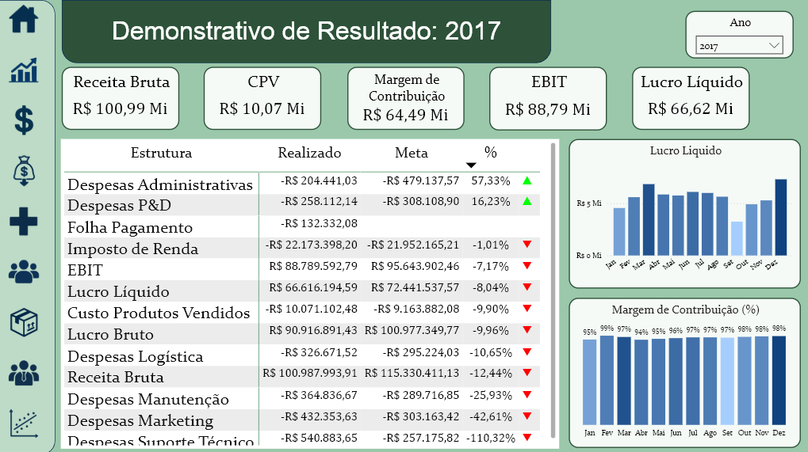
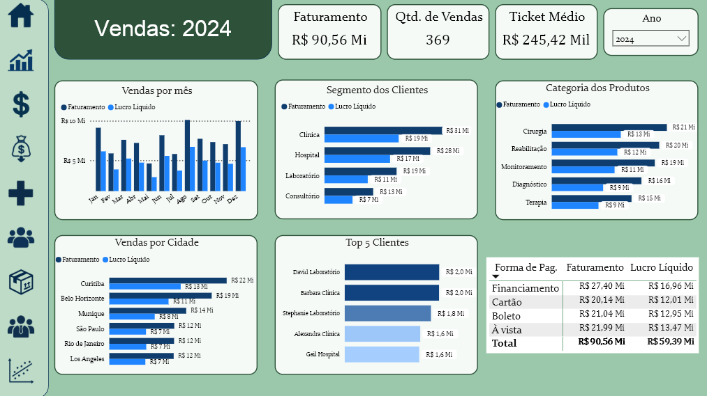
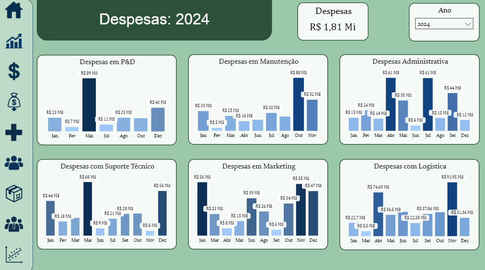
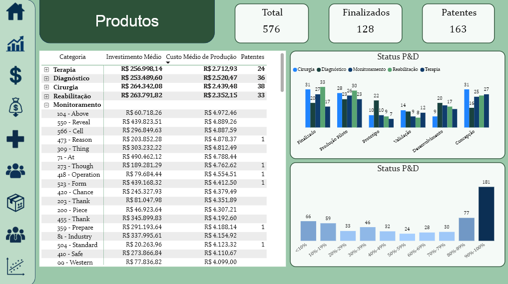
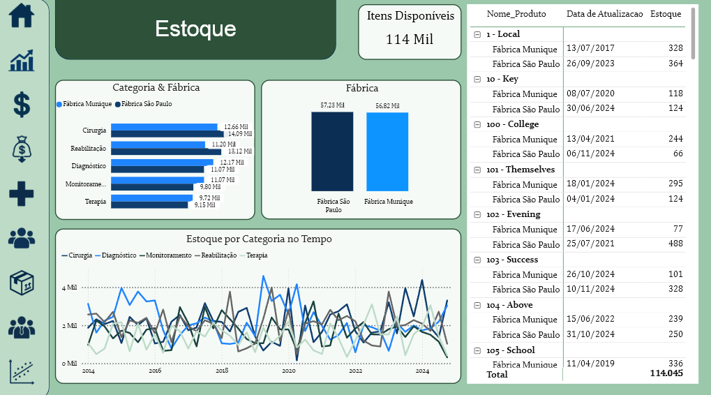
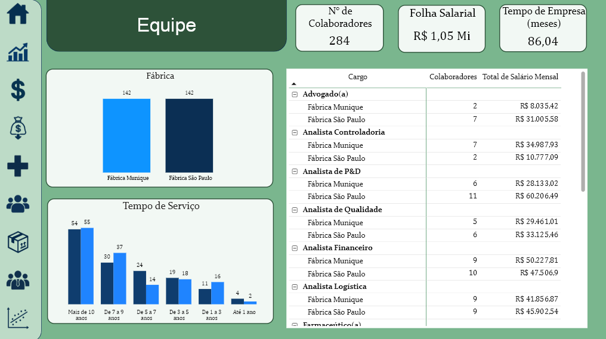
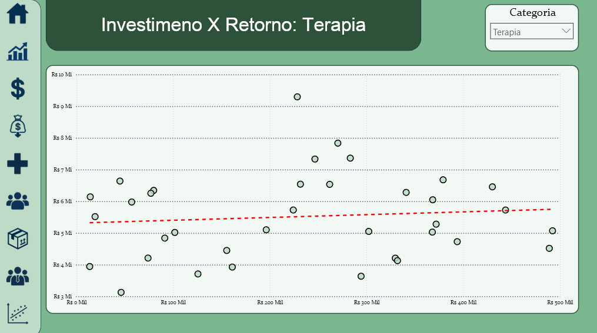

# 📊 Projeto BI - Healthcare

Este repositório contém a modelagem de dados, scripts e dashboards em Power BI para análise integrada de uma empresa fictícia do setor de **Engenharia e Saúde**.  
O objetivo do projeto é consolidar dados de diferentes áreas (Vendas, Produtos, Clientes, Estoque, Equipe, P&D, Despesas) e fornecer **insights para a tomada de decisão estratégica**.

---

## ⚙️ Modelagem de Dados

O banco foi estruturado em **dimensões** e **fatos**, permitindo análises no modelo estrela (star schema).  

- **Dimensões**
  - `dim_Produtos` → Produtos e atributos de P&D  
  - `dim_Clientes` → Clientes e informações de contato  
  - `dim_Equipe` → Funcionários e cargos  
  - `dim_Localizacao` → Localização de clientes/fábricas
  - `dim_Fabrica` → Fábricas

- **Fatos**
  - `fact_Vendas` → Vendas consolidadas  
  - `fact_CustosDespesas` → Despesas operacionais e administrativas  
  - `fact_Estoque` → Movimentação de estoque  

---

## 📈 Principais Dashboards

### 1. **DRE (Demonstrativo de Resultados)**
- Receita líquida mensal  
- Custos e despesas  
- Margem de contribuição e lucro líquido  

### 2. **Vendas**
- Evolução de vendas por mês/ano  
- Top 5 clientes  
- Produtos mais vendidos  

### 3. **Despesas**
- Despesa anual  
- Despesa com P&D, Manutenção, Administrativo, Suporte Técnico, Marketing e Logística

### 4. **Produtos & P&D**
- Status de desenvolvimento   
- Investimento acumulado em P&D  
- Número de patentes  

### 5. **Clientes**
- Segmento dos clientes (PF/PJ)  
- Status, receita, ticket médio dos clientes
- Distribuição geográfica  

### 6. **Estoque**
- Nível de estoque por produto e fábrica  
- Giro de estoque  

### 7. **Equipe**
- Distribuição de cargos por fábrica  
- Tempo de empresa  
- Custo com folha salarial  

### 8. **Investimento & Retorno**
- Relação investimento em P&D x Receita gerada  

---

## 📊 Métricas e KPIs

Alguns indicadores calculados no Power BI (via DAX):

- **Receita Líquida** = `[Receita Bruta] - [Impostos] - [Devoluções]`
- **Margem de Contribuição %** = `(Receita Líquida - Custos Variáveis) / Receita Líquida`
- **EBITDA** = Receita Líquida - Custos Operacionais
- **Top 5 Clientes** (Ranking por compras acumuladas)
- **% Conclusão P&D** (regra dinâmica conforme status do produto)

---

## 🚀 Como Executar

1. Restaure o banco no SQL Server usando o arquivo `sql/schema.sql`  
2. Execute os `INSERTs` gerados em `/inserts/` (ou gere novos via scripts em `/data_generation/`)  
3. Abra o arquivo `pbix/BI-HC.pbix` no Power BI Desktop  
4. Configure a conexão com seu SQL Server local  
5. Atualize os dados e explore os relatórios  

---

## 🛠 Ferramentas Utilizadas

- **SQL Server** → Modelagem e armazenamento dos dados  
- **Python (Faker, Pandas, Numpy)** → Geração de dados sintéticos  
- **Power BI** → Construção de dashboards  

---

✍️ **Autor:** Eduardo Coelho  
📅 **Ano:** 2025
